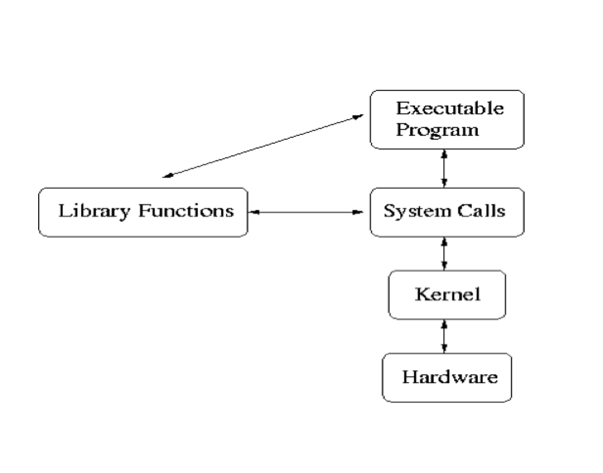
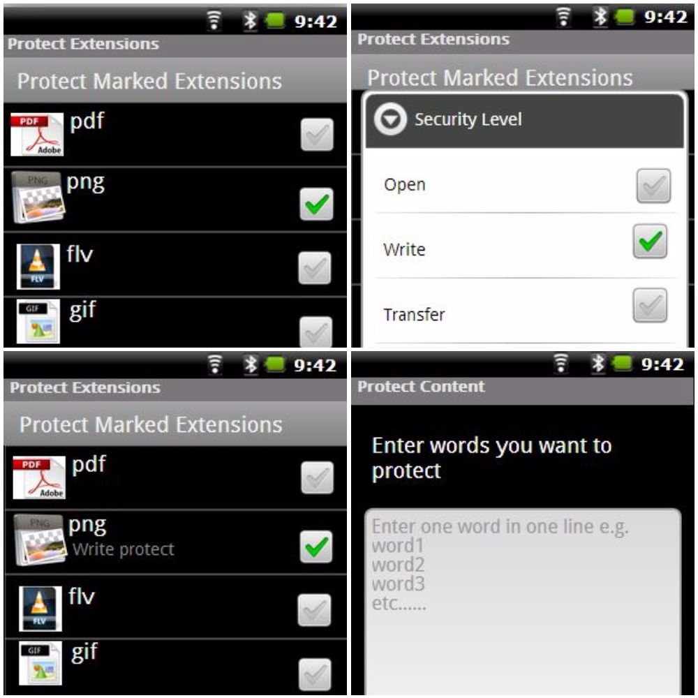

# Linux-SystemCallTable-Hooking
This a Loadable Kernel Module (LKM) for System Call Table Hooking along with a user space C++ program to communicate and control it. I coded it almost 4 years back. Just pushing it Github for a memory. 

This LKM when enabled **checks type of every file opened on any Linux based system like Ubuntue, Android** and if instructed by user space program `driver.cpp` blocks all files of specific type. So for example, if LKM `file:proc.c` is loaded and user space program **`driver.cpp` instructs it to block all files of type _PDF_ then no one will be able to read or write any file of type PDF**. As file type is saved as a magic code in first few characters of each file so this LKM is not that expensive in terms of comparsion but there is definitely a cost in terms of file IO.

I wrote this program when I was studying **Linux System Programming** and **Linux Operating System**. As I knew how files were saved and opened and how `system calls` were executed when a call is received from user space to kernel space so it was a fun project at that time. Here is how call flow looks like.

I also deployed it to Android and also developed an Android application to control this LKM through an Android app. Below are some screenshots of the app and how it allowed user to control LKM.

